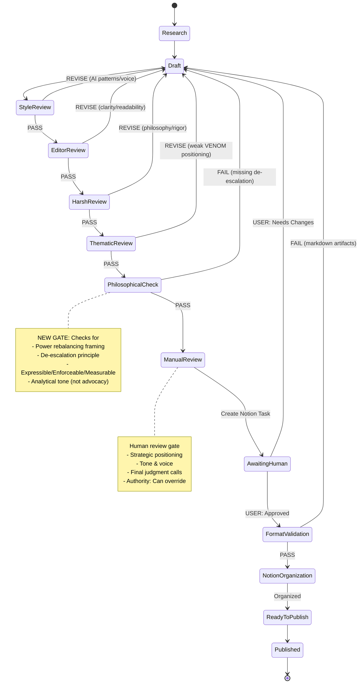

# VENOM Content Workflow - Complete State Machine
**Version**: 2.0 (with Manual Review gate and feedback loops)
**Updated**: 2026-01-15

---

## Complete State Machine with All Feedback Loops



---

## Detailed Stage Descriptions

### Stage 1: Research
**Agent**: ResearchAndCitations
**Purpose**: Gather sources, citations, evidence
**Output**: Research brief with citations
**Next**: Always proceeds to Draft
**Cannot send back**: Initial stage

---

### Stage 2: Draft
**Agent**: ContentWriter
**Purpose**: Create content from brief
**Output**: Markdown file with content
**Next**: Proceeds to StyleReview
**Receives feedback from**:
- StyleReview (AI patterns/voice issues)
- EditorReview (clarity/readability issues)
- HarshReview (philosophy/rigor issues)
- ThematicReview (VENOM positioning issues)
- PhilosophicalCheck (philosophy conformance issues)
- ManualReview (strategic/tone issues via Notion)
- FormatValidation (markdown artifacts)

**ContentWriter receives most feedback loops** - central revision hub

---

### Stage 3: StyleReview (NEW)
**Agent**: StyleEditor
**Purpose**: Eliminate AI writing patterns and enforce authentic voice
**Checks**:
- Dead giveaway words (delve, tapestry, leverage, etc.)
- Dead giveaway phrases ("In today's fast-paced world", "Let's dive in")
- Em-dash abuse (max 1 per piece)
- Tricolon patterns (Rule of Three abuse)
- Enthusiasm markers (!, "exciting", "amazing")
- Invented examples ("Sarah Chen")
- Structural tells (balanced sentences, excessive signposting)

**Verdict Options**:
- **PASS** → Proceeds to EditorReview
- **REVISE** → Returns to Draft with specific pattern feedback

**Common REVISE reasons**:
- Multiple dead giveaway words found
- Em-dash count > 1
- Tricolon abuse detected
- Enthusiasm markers present
- AI structural patterns

**Automated Script**: `scripts/apply_style_review.py`

**Historical pass rate**: Expected ~20% first submission (AI patterns common), ~100% after fixes

---

### Stage 4: EditorReview
**Agent**: EditorAndConsistency
**Purpose**: Readability for target audience
**Checks**:
- Grammar and clarity
- Flow and structure
- Visual comprehension
- Accessibility of technical concepts
- Engagement and pacing

**Verdict Options**:
- **PASS** → Proceeds to HarshReview
- **REVISE** → Returns to Draft with specific feedback

**Common REVISE reasons**:
- Jargon without explanation
- Poor flow between sections
- Technical concepts too dense or too simple
- Meandering structure

---

### Stage 5: HarshReview
**Agent**: HarshEditor
**Purpose**: Apply semiautonomous.systems philosophy rigor
**Checks**:
- Enforcement over signaling (core framework)
- Measurement over promises (quantify or acknowledge gaps)
- Power rebalancing analysis (who pays, who benefits)
- Nuance over binaries (acknowledge trade-offs)
- Reject marketing language, speculation, unsubstantiated claims

**Verdict Options**:
- **PASS** → Proceeds to ThematicReview
- **REVISE** → Returns to Draft with blocking issues

**Common REVISE reasons**:
- Unsubstantiated cost claims
- "May" epidemic (vague speculation)
- Missing power dynamics analysis
- Collateral damage under-analyzed
- Marketing language ("world's leading", "groundbreaking")

**Historical pass rate**: ~0% first submission, ~100% after fixes

---

### Stage 6: ThematicReview
**Agent**: ThematicReviewer
**Purpose**: Ensure VENOM brand positioning and thematic consistency
**Checks**:
- Introduction establishes why VENOM's analysis matters
- Conclusion positions VENOM's unique value
- Frameworks attributed to VENOM (not generic)
- All five thematic pillars present:
  1. Enforcement vs Signaling
  2. Power Dynamics
  3. Cost Analysis
  4. Measurement
  5. Collateral Damage
- Terminology consistent with VENOM canon

**Verdict Options**:
- **PASS** → Proceeds to PhilosophicalCheck
- **REVISE** → Returns to Draft with positioning feedback

**Common REVISE reasons**:
- "Could be written by any analyst" (no VENOM attribution)
- Frameworks used but not attributed to VENOM
- Zero VENOM mentions until halfway through
- Conclusion doesn't reinforce VENOM's unique value

**Historical pass rate**: ~0% initial (Week 1 needed positioning), ~100% after fixes

---

### Stage 7: PhilosophicalCheck
**Agent**: Automated audit (runs after ThematicReview)
**Purpose**: Verify semiautonomous.systems philosophy conformance
**Checks**:
- **Power rebalancing framing**: Tools positioned as rebalancing power, not just attack/defense
- **De-escalation principle**: "Honest access should be cheaper than cheating" present
- **Three principles**: Expressible, Enforceable, Measurable mentioned where relevant
- **Analytical tone**: Analysis, not advocacy; opposing views steelmanned
- **No red flags**: Content doesn't read as "escalation is good" or "poisoning is the answer"

**Automated Check Script**: `scripts/philosophical_conformance_check.py`

**Verdict Options**:
- **PASS** → Proceeds to ManualReview
- **FAIL** → Returns to Draft with philosophical issues flagged

**Common FAIL reasons**:
- Missing power rebalancing framing in introduction
- De-escalation principle absent
- Reads as advocacy instead of analysis
- Collateral damage ignored or dismissed
- One-sided framing (only benefits, no costs)

**Implementation**:
```python
def check_philosophical_conformance(content_file):
    checks = {
        "power_rebalancing": check_power_framing(content),
        "de_escalation": check_de_escalation_principle(content),
        "three_principles": check_expressible_enforceable_measurable(content),
        "analytical_tone": check_not_advocacy(content),
        "no_red_flags": check_escalation_language(content)
    }

    if all(checks.values()):
        return "PASS"
    else:
        return "FAIL", generate_feedback(checks)
```

---

### Stage 8: ManualReview
**Agent**: Human reviewer (you)
**Purpose**: Final judgment before publication
**Checks**:
1. Strategic positioning (builds VENOM authority?)
2. Tone & voice (Nick Sullivan + semiautonomous.systems?)
3. Philosophical consistency (power rebalancing, de-escalation?)
4. Technical accuracy (citations correct?)
5. Reader experience (clear, engaging?)

**Process**:
1. Automated task created in Notion review queue
2. Deadline set (1 week before publication)
3. Human reviewer reads content
4. Human makes decision in Notion

**Verdict Options**:
- **APPROVED** → Proceeds to FormatValidation
- **NEEDS CHANGES** → Returns to Draft with feedback in Review Notes

**Common NEEDS CHANGES reasons**:
- Strategic positioning weak
- Tone issues (hype, marketing)
- Missing nuance human reviewers catch
- "Doesn't feel right for VENOM"
- Edge cases requiring judgment

**Authority**: Human reviewer has final say, can override all automated gates

---

### Stage 9: FormatValidation
**Agent**: NotionOrganizer
**Purpose**: Scan for markdown artifacts, format issues, and visual content requirements
**Checks**:
- ** for bold → Must use rich_text with {"bold": true}
- * for italic → Must use rich_text with {"italic": true}
- ` for code → Must use proper Notion code blocks
- Markdown headings → Notion heading blocks
- Lists formatted correctly
- Posts over 1500 words MUST contain at least one inline image
- All images MUST have descriptive alt text (not empty or generic)
- Image files MUST exist at the referenced path
- Image dimensions MUST be at least 600px wide

**Verdict Options**:
- **PASS** → Proceeds to NotionOrganization
- **FAIL** → Returns to Draft with format violations flagged

**Auto-fix**: NotionOrganizer attempts to auto-convert markdown to rich text

**Creator flagging**: If violations found, updates creator persona with formatting requirements

**Historical issue**: ContentWriter was flagged with 1,311 markdown violations on one page

---

### Stage 10: NotionOrganization
**Agent**: NotionOrganizer
**Purpose**: Upload to Notion and organize in workspace
**Actions**:
- Uploads content to Notion (proper rich text, no markdown)
- Moves to "Ready to Publish" folder
- Updates landing pages
- Creates internal links

**Output**: Content in Notion, organized, ready for scheduling

**Next**: Proceeds to ReadyToPublish

---

### Stage 11: ReadyToPublish
**Status**: Content approved and organized
**Actions**:
- Content in "Ready to Publish" folder
- Can be scheduled for publication
- Can be shared with SocialMediaCoordinator for distribution

**Next**: Published (scheduled or manual)

---

### Stage 12: Published
**Final state**: Content is public
**Distribution**:
- Blog: Website, Medium, Substack
- Threads: Twitter/X
- Press: Journalists, analysts
- Community: Forums, discussions

---

## Feedback Loop Summary

### Most Common Loop: Draft ← EditorReview ← HarshReview ← ThematicReview
**Reason**: Iterative refinement for quality, philosophy, positioning

**Typical cycle**:
1. First draft → EditorReview: PASS
2. EditorReview → HarshReview: REVISE (5-9 blocking issues)
3. Fixed → HarshReview: PASS
4. HarshReview → ThematicReview: REVISE (no VENOM positioning)
5. Positioned → ThematicReview: PASS
6. ThematicReview → PhilosophicalCheck: PASS (if philosophy already integrated)
7. PhilosophicalCheck → ManualReview: PASS
8. ManualReview → Approved or Needs Changes

**Average cycles**: 2-3 rounds before passing all automated gates

---

### New Loop: Draft ← PhilosophicalCheck
**Reason**: Catch philosophical misalignment before manual review

**Purpose**: Ensure semiautonomous.systems philosophy is central, not afterthought

**Typical issues**:
- Missing power rebalancing framing
- De-escalation principle absent
- Advocacy tone instead of analysis
- Collateral damage dismissed

**Fix time**: Usually 1 round (clear feedback, specific requirements)

---

### Manual Loop: Draft ← ManualReview (via Notion)
**Reason**: Human catches strategic/tone issues automated gates miss

**Process**:
1. Human reviews content
2. Adds feedback in Notion "Review Notes"
3. Sets status to "Needs Changes"
4. ContentWriter receives feedback
5. Makes fixes
6. Re-runs through automated gates (Editor → Harsh → Thematic → Philosophical)
7. Returns to ManualReview

**Authority**: Human has final say, can reject content automated gates approved

---

### Format Loop: Draft ← FormatValidation
**Reason**: Markdown artifacts in Notion content

**Auto-fix**: NotionOrganizer attempts automatic conversion

**If auto-fix fails**: Returns to Draft with specific format violations

**Creator flagging**: Persona updated with explicit formatting requirements

---

## Quality Gate Statistics (Week 1)

### First Submission
- **EditorReview**: 100% PASS (5/5 pieces)
- **HarshReview**: 0% PASS (0/5 pieces - all REVISE)
- **ThematicReview**: Not reached initially

### After First Fixes
- **HarshReview**: 100% PASS (5/5 pieces)
- **ThematicReview**: 0% PASS (0/5 pieces - all REVISE for positioning)

### After VENOM Positioning
- **ThematicReview**: 100% PASS (5/5 pieces)
- **PhilosophicalCheck**: 100% PASS (6/6 pieces including Launch blog)
- **ManualReview**: Awaiting review (0/6 completed)

### Total Cycles
- **Average**: 2-3 rounds per piece
- **Range**: 2 (threads) to 3 (complex blogs)

---

## Workflow Enforcement Rules

### Rule 1: No Skipping Stages
**Violation**: ContentWriter attempts to skip HarshEditor
**Enforcement**: Orchestrator blocks and requires proper flow

### Rule 2: No Batching Completions
**Violation**: Mark multiple todos complete without actual review
**Enforcement**: Each gate must produce verdict before proceeding

### Rule 3: REVISE Verdicts Must Loop Back
**Violation**: Proceed to next stage despite REVISE verdict
**Enforcement**: Workflow automatically routes back to Draft

### Rule 4: Human Review is Mandatory
**Violation**: Move to ReadyToPublish without manual approval
**Enforcement**: Notion task blocks publication until "Approved" status

### Rule 5: Format Validation Runs on All Content
**Violation**: Upload markdown artifacts to Notion
**Enforcement**: FormatValidation scans all content, flags violations

---

## Implementing the State Machine

### In Code (Python)
```python
class WorkflowStateMachine:
    def __init__(self):
        self.current_stage = "Research"
        self.content_file = None
        self.feedback = []

    def transition(self, verdict):
        transitions = {
            ("Research", "COMPLETE"): "Draft",
            ("Draft", "READY"): "EditorReview",
            ("EditorReview", "PASS"): "HarshReview",
            ("EditorReview", "REVISE"): "Draft",
            ("HarshReview", "PASS"): "ThematicReview",
            ("HarshReview", "REVISE"): "Draft",
            ("ThematicReview", "PASS"): "PhilosophicalCheck",
            ("ThematicReview", "REVISE"): "Draft",
            ("PhilosophicalCheck", "PASS"): "ManualReview",
            ("PhilosophicalCheck", "FAIL"): "Draft",
            ("ManualReview", "APPROVED"): "FormatValidation",
            ("ManualReview", "NEEDS CHANGES"): "Draft",
            ("FormatValidation", "PASS"): "NotionOrganization",
            ("FormatValidation", "FAIL"): "Draft",
            ("NotionOrganization", "COMPLETE"): "ReadyToPublish",
            ("ReadyToPublish", "SCHEDULED"): "Published",
        }

        key = (self.current_stage, verdict)
        if key in transitions:
            self.current_stage = transitions[key]
            return self.current_stage
        else:
            raise ValueError(f"Invalid transition: {key}")

    def get_feedback_destination(self):
        """All REVISE/FAIL/NEEDS CHANGES verdicts return to Draft"""
        return "Draft"

    def record_feedback(self, stage, verdict, feedback):
        self.feedback.append({
            "stage": stage,
            "verdict": verdict,
            "feedback": feedback,
            "timestamp": datetime.now()
        })
```

### In Notion (Status Property)
```
Content Status Property Options:
- 📝 Draft
- 👀 In Editor Review
- 🔬 In Harsh Review
- 🎨 In Thematic Review
- 🧠 In Philosophical Check
- 👤 Awaiting Manual Review
- ✅ Approved (Manual)
- 🔄 Needs Revision
- 📋 Format Validation
- 📂 Organizing
- ✨ Ready to Publish
- 🚀 Published
```

---

## Emergency Overrides

### When Human Can Override Automated Gates

**Scenario 1**: Automated gate rejects, but human judges it acceptable
**Action**: Human can approve in ManualReview despite earlier REVISE verdicts
**Authority**: Human final say

**Scenario 2**: Automated gates approve, but human judges it unacceptable
**Action**: Human can request changes in ManualReview
**Authority**: Human final say trumps all automated gates

**Scenario 3**: Urgent publication needed, abbreviated workflow requested
**Action**: User explicitly requests workflow bypass
**Response**: Document override, note quality gates skipped
**Authority**: User can override entire workflow

---

## Continuous Improvement

### Monitoring Quality Gate Effectiveness

**If HarshEditor rejection rate stays high**:
→ Update ContentWriter persona with common issues
→ Add pre-flight checks to ContentWriter

**If ThematicReviewer rejection rate stays high**:
→ Update ContentWriter persona with VENOM positioning examples
→ Add positioning checklist to ContentWriter

**If PhilosophicalCheck rejection rate > 10%**:
→ Update ContentWriter persona with philosophy training
→ Add philosophy checklist to draft stage

**If ManualReview rejection rate > 30%**:
→ Automated gates may need tuning
→ Review criteria may need clarification
→ Consider adding intermediate gate

---

## Summary

**Total stages**: 12 (Research → Published)
**Quality gates**: 7 (Style, Editor, Harsh, Thematic, Philosophical, Manual, Format)
**Feedback loops**: 7 (back to Draft)
**Human authority**: Absolute (ManualReview can override all automated gates)
**AI pattern elimination**: 1 gate (StyleReview)
**Philosophy enforcement**: 2 gates (HarshReview for rigor, PhilosophicalCheck for conformance)
**VENOM positioning enforcement**: 1 gate (ThematicReview)

**Key insight**: Multiple feedback loops ensure quality, but all loop back to Draft as central revision hub. ContentWriter receives feedback from 6 different gates and must address all issues before proceeding.

**Result**: High-quality content that passes rigorous standards before reaching human review, making manual review efficient and focused on strategic judgment rather than fixing basic issues.
